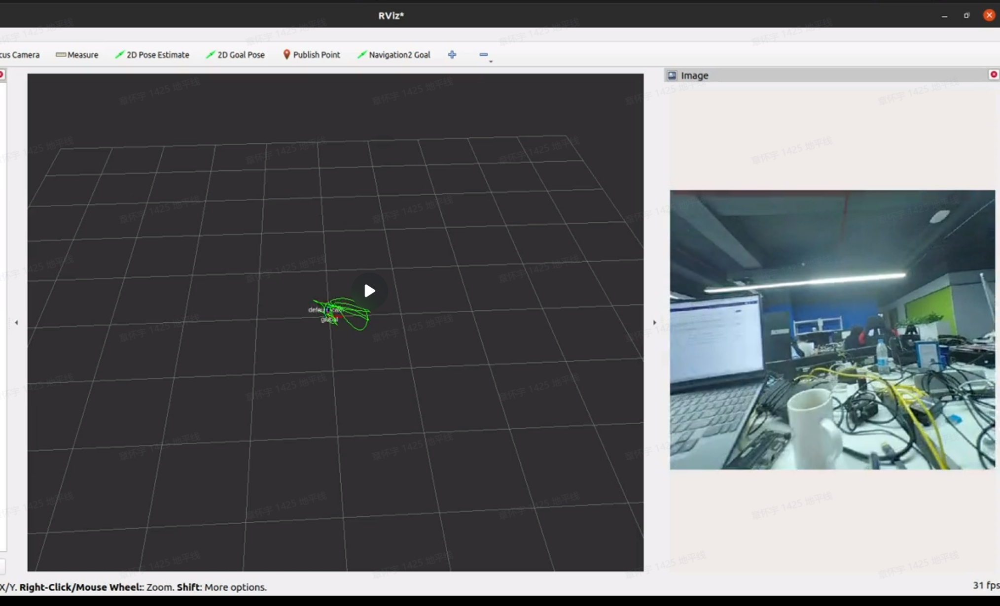
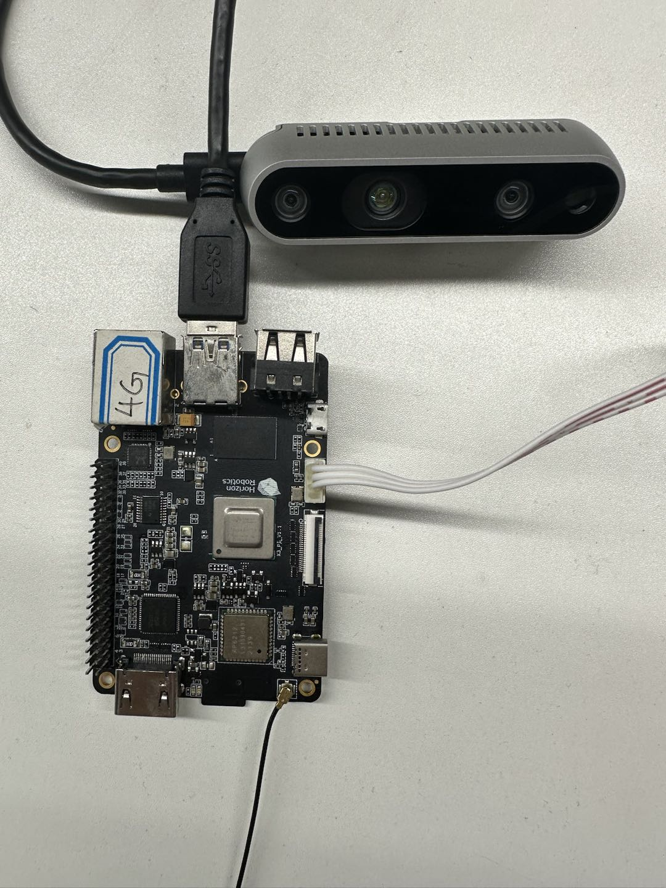
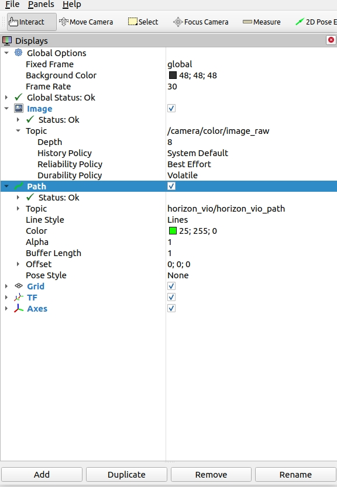
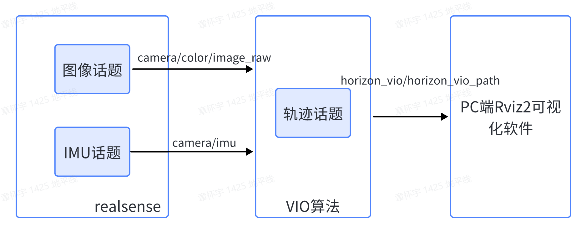

English| [简体中文](./README_cn.md)

# Function Introduction

Visual Inertial Odometry (VIO) is an algorithm that integrates camera and Inertial Measurement Unit (IMU) data to achieve robot localization. The VIO positioning algorithm has the advantages of low cost and wide applicability, and can effectively compensate for failure scenarios such as occlusion and multipath interference in satellite positioning in outdoor environments. An excellent and robust VIO algorithm is key to achieving high-precision outdoor navigation positioning.

Code Repository: <https://github.com/HorizonRDK/hobot_vio.git>

# Bill of Materials

| Robot Name         | Manufacturer | Reference Link                                               |
| :----------------- | ------------ | ------------------------------------------------------------ |
| RDK X3             | See reference link | [Click to jump](https://developer.horizon.cc/sunrise)      |
| Realsense          | Intel RealSense D435i |             |

# User Instructions

## Preparation

Before experiencing, the following basic conditions need to be met:

- The Horizon RDK has been burned with the Ubuntu 20.04 system image provided by Horizon.
- The Horizon RDK has been installed.
- Realsense is connected to the RDK X3 via USB 3.0 interface.

The algorithm subscribes to the image and IMU data of the Realsense camera as input, calculates the camera's trajectory information, and publishes the camera’s motion trajectory through the topic mechanism of ROS2. The trajectory results can be viewed in the rviz2 software on a PC.


## Hardware Connection
The connection method between Realsense and RDK X3 is as shown in the following picture:
 
 
**1. Install Package**

After starting the robot, connect to the robot through the terminal or VNC, copy and run the following command on the RDK system to complete the installation of the related Node.

```bash
sudo apt update
sudo apt install -y tros-hobot-vio
```
 
**2. Run VIO Feature**

To start the command, the launch file contains the commands for starting the Realsense camera and VIO algorithm module, so only one launch file needs to be run:

```shell
# Configure the tros.b environment
source /opt/ros/foxy/setup.bash
source /opt/tros/local_setup.bash

```ros2 launch hobot_vio hobot_vio.launch.py 
```

Upon program execution, it will enter a waiting initialization state, during which the camera must remain stationary.
 
At this point, when the camera is translated forward by a certain distance, the algorithm will detect the translation and complete the initialization. Subsequently, the camera continues to move, initiating the visual-inertial fusion localization process.
 

**3. Viewing the Results**
To observe the effect of the VIO algorithm, use rviz2, which requires ROS2 to be installed on a PC. Ensure that the PC and RDK X3 are on the same network segment.
The subscription topics in rviz2 are configured as shown below, with detailed explanations provided in the "Interface Explanation" section:
 

 The visualization results are shown in the animated image below:


# Interface Explanation

 


## Input Topics
| Parameter Name | Type | Description | Mandatory | Default Value |
| ----- | ----| -----| ------- | -----|
| path_config  | std::string | Path to the VIO algorithm configuration file | Yes | /opt/tros/${tros_distro}/lib/hobot_vio/config/realsenseD435i.yaml |
| image_topic  | std::string | Name of the topic where VIO algorithm subscribes for image data  | Yes | /camera/infra1/image_rect_raw |
| imu_topic    | std::string | Name of the topic where VIO algorithm subscribes for IMU data  | Yes | /camera/imu  |
| sample_gap  | std::string | Processing frequency of the VIO algorithm, where 1 implies trajectory calculation for every frame, 2 implies calculation every two frames, and so on | Yes  | 2 |

## Output Topic

| Topic Name | Type | Description |
| ----- | ----| -----| 
| horizon_vio/horizon_vio_path  | nav_msgs::msg::Path | Robot's motion trajectory output by the VIO algorithm  |


# FAQs
1. Running the launch command on Ubuntu results in an error: -bash: ros2: command not found
   This occurs when the terminal environment is not configured for ROS2. Execute the following command to set up the environment:
```
source /opt/tros/local_setup.bash
```
2. How to install the realsense ROS2 package on RDK
```
# Example using ROS2 Foxy version
sudo apt-key adv --keyserver keyserver.ubuntu.com --recv-key F6E65AC044F831AC80A06380C8B3A55A6F3EFCDE 
sudo apt-key adv --keyserver hkp://keyserver.ubuntu.com:80 --recv-key F6E65AC044F831AC80A06380C8B3A55A6F3EFCDE
sudo curl -sSL https://raw.githubusercontent.com/ros/rosdistro/master/ros.key -o /usr/share/keyrings/ros-archive-keyring.gpg
echo "deb [arch=$(dpkg --print-architecture) signed-by=/usr/share/keyrings/ros-archive-keyring.gpg] http://packages.ros.org/ros2/ubuntu $(source /etc/os-release && echo $UBUNTU_CODENAME) main" | sudo tee /etc/apt/sources.list.d/ros2.list > /dev/null
``````
sudo apt-get install software-properties-common
sudo add-apt-repository "deb https://librealsense.intel.com/Debian/apt-repo $(lsb_release -cs) main" -u
sudo apt-get update
sudo apt-get install ros-foxy-librealsense2* ros-foxy-realsense2-camera ros-foxy-realsense2-description -y
```
3. How to save the trajectory of VIO algorithm
After the program starts, it will automatically save the trajectory in real time to a file named trans_quat_camera_xx.txt. The content of the file is as follows:
```
1688615183.065757036 -0.081376 -0.040180 0.030833 -0.501420 -0.461689 0.520512 0.514285
......
```
The columns of data represent timestamp, x, y, z coordinates, quaternion w, x, y, z.

4. VIO Notes:

a. Monocular VIO requires initialization before running, please refer to section "2. Run VIO Function" for details.

b. Try to move the camera smoothly during operation.